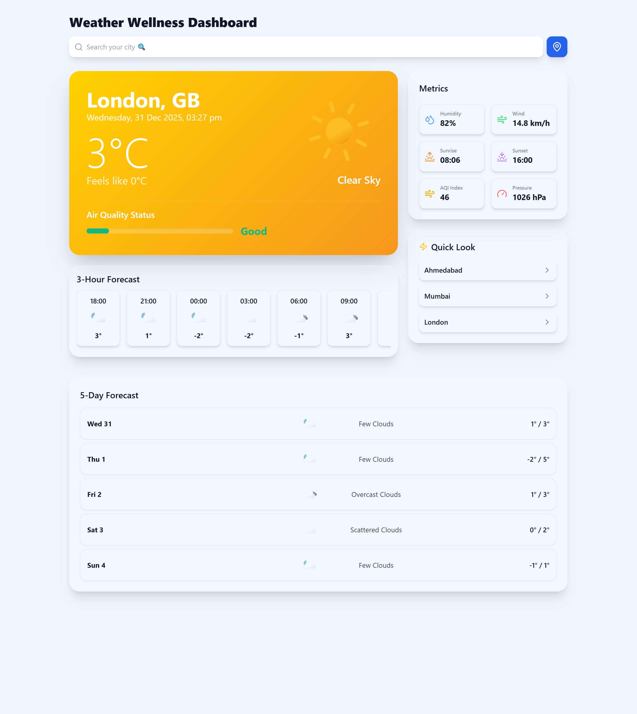

# 🌦️ Weather Wellness Dashboard

A simple, clean weather app that goes a step beyond just showing temperature. It focuses on daily wellness by keeping air quality (AQI) front and center and automatically switching its look based on whether it’s day or night in the selected location.

## 🔗 Live App
- **Production:** [View Live Site](https://weather-wellness-dashboard.vercel.app/)

---

## 📸 Project Preview

| Day Mode | Night Mode |
| :---: | :---: |
|  |  |
| *Clear skies and bright gradients.* | *Automatic dark theme after sunset.* |

---

## Why I built this
Most weather apps feel cluttered or hide important info like air quality. I wanted something that:
1. **Clearly shows if it’s a good day to go outside:** AQI is prioritized for health-conscious users.
2. **Dynamic UI:** Automatically switches to a night theme after sunset in your city using local time data.
3. **Performance:** Loads fast, looks clean, and works well on mobile.

## 🛠 What’s under the hood
- **Core:** HTML, Tailwind CSS, Vanilla JavaScript
- **Weather Data:** OpenWeatherMap API
- **Air Quality:** WAQI (AQICN) API
- **Icons:** Lucide icons and weather SVGs

## 🚀 Running locally
1. **Clone the repository**
2. **Get your free API keys:**
   - [OpenWeatherMap](https://openweathermap.org/)
   - [AQICN API](https://aqicn.org/api/)
3. **Configure:** Add your keys to the constants at the top of `script.js`
4. **Launch:** Open `index.html` in your browser.

*No build tools or frameworks needed—just pure, vanilla web power.*

## ✨ UI & Behavior
- **Dynamic Gradients:** Backgrounds shift based on specific weather conditions (Rainy, Sunny, Cloudy).
- **Localized Night Mode:** Uses the timezone and sunset data of the searched city, not just your local browser time.
- **Mobile First:** Responsive layout designed for readability on the go.

---

Feel free to fork the project or use the code in your own apps.
